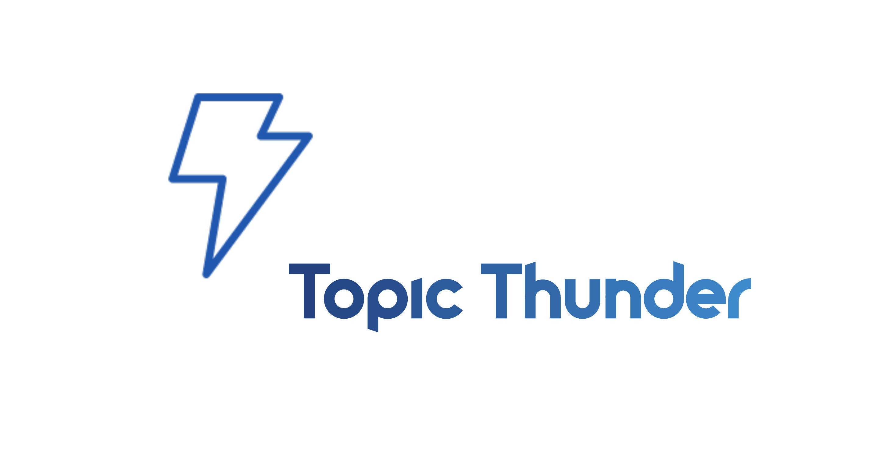

# ci-topic-thunder


Repo for storing code related to topic thunder master thesis project.


### Auxiliary 
- MLFlow server : http://ec2-18-184-134-25.eu-central-1.compute.amazonaws.com
    - Credentials: mlflow / mlflow
- S3 Buckets: 
    - s3://ci-topic-thunder/
    - s3://ci-mlflow-server/

### Dir structure
- code - contains all the Python modules and classes needed to run exeperiments.
- data -  CSV files needed to run exeperiments as well as scripts to download them.
- models - models and scripts needed to download them
- papers - research papers and PDF resources for thesis
- notebooks - notebooks with exeperiments


   
Syncronising data folder with the latest version of data from S3:
```
$ cd ./data
$ ./sync.sh
``` 


## Resources:
#### Articles:
- Comprehesive overview of documents embeding techniques with lots of references and comparisons:  https://towardsdatascience.com/document-embedding-techniques-fed3e7a6a25d
- https://supernlp.github.io/2018/11/26/sentreps/
- http://mlexplained.com/2019/01/07/paper-dissected-bert-pre-training-of-deep-bidirectional-transformers-for-language-understanding-explained/
- Explanation of the SBERT: https://medium.com/genei-technology/richer-sentence-embeddings-using-sentence-bert-part-i-ce1d9e0b1343
- MLFLOW Setup :https://github.com/ymym3412/mlflow-docker-compose#3-Set-up-NGINX-Basic-Authentication

#### Papers:
- PV for Vox Media + Wikipedia: 
- https://www.catalyzex.com/paper/arxiv:1208.4411
- https://www.sciencedirect.com/science/article/pii/S1532046416300442
- https://reader.elsevier.com/reader/sd/pii/S1532046416300442
- Effective Dimensionality reduction for word embeddings - https://www.aclweb.org/anthology/W19-4328/


